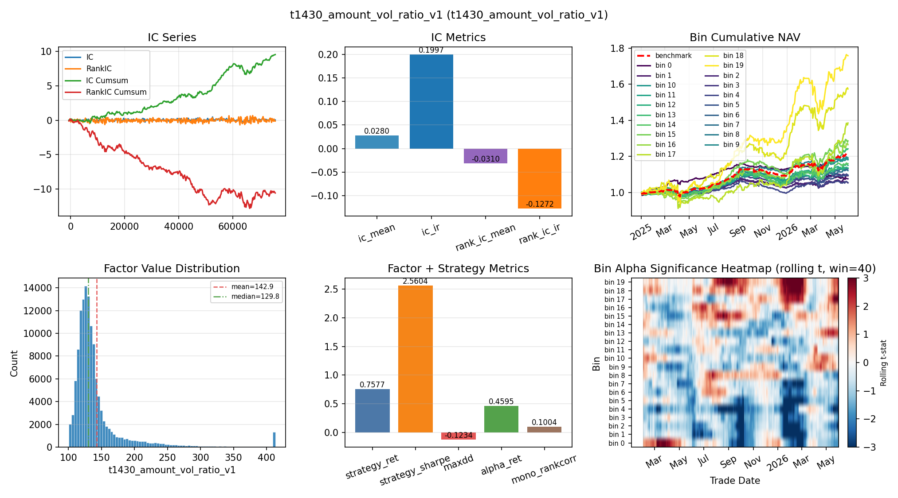
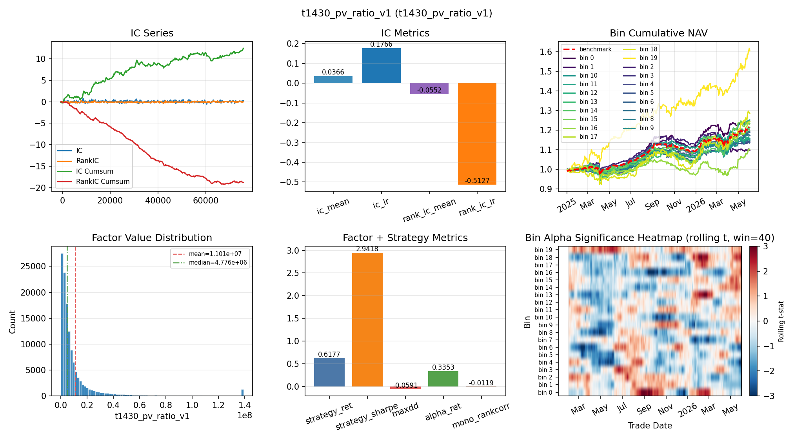
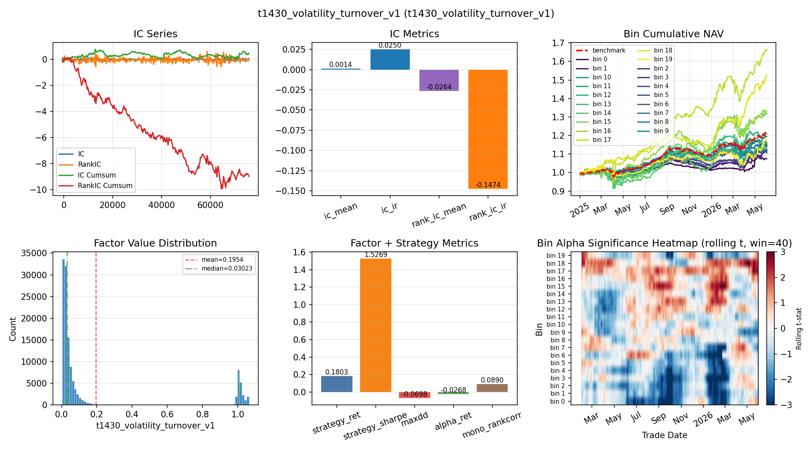
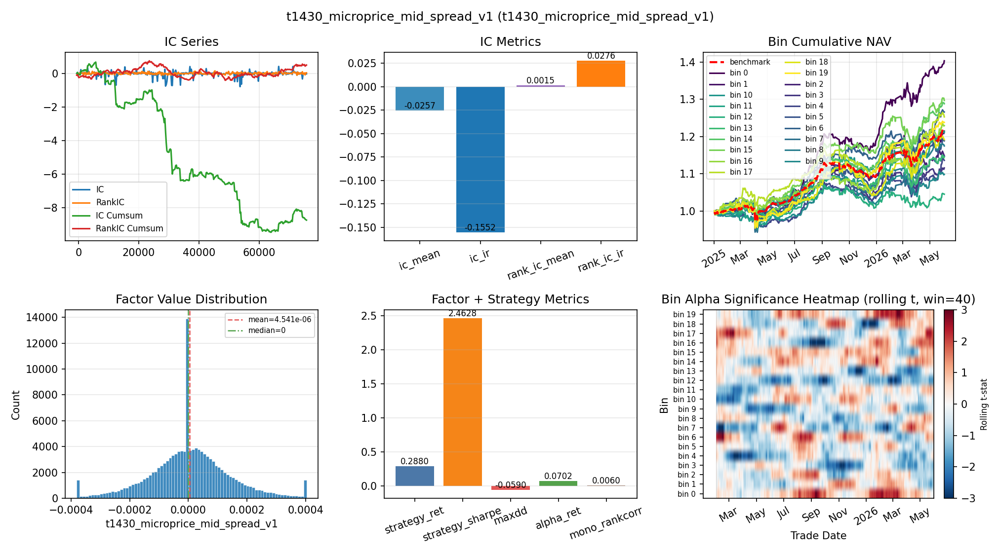
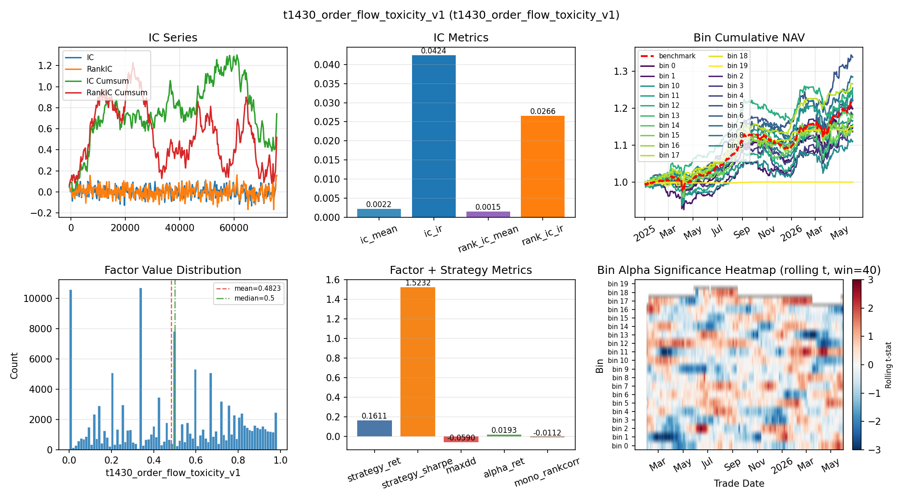
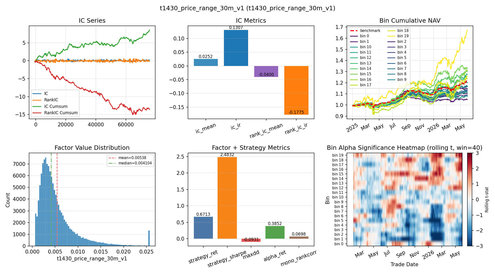
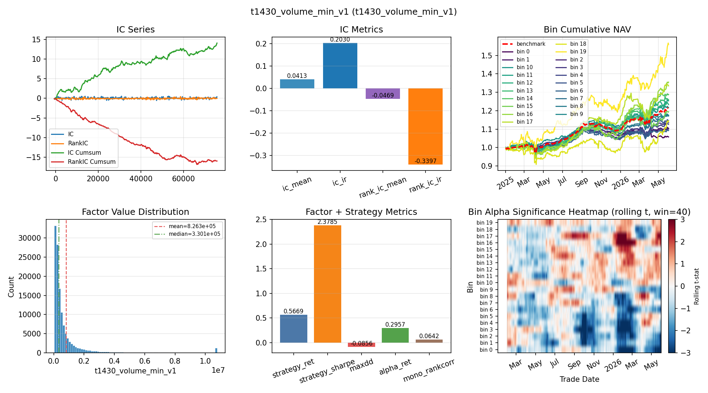

# AI 因子工厂说明

## 1. 一句话介绍

AI 因子工厂是一个用 Agent/Dify 自动生成候选因子，再由本地代码完成去重、审核、入库、回测和筛选的 research-only 因子扩展链路。

核心边界：Agent 只负责提出候选想法和草稿，本地项目负责可信执行，包括字段白名单、时间可见性检查、重复因子拦截、静态审核、因子落地、batch 回测和样本外筛选。

## 2. 流程简述

1. 生成候选因子
   - Dify Workflow 根据主题、约束、可用字段、禁用输入和输出 schema 生成因子 draft。
   - Prompt 位于 `docs/ai_factor_factory_dify_prompt.md`。
   - Dify 连接配置位于用户本地密钥文件，不写入仓库。

2. 本地审核候选
   - 检查字段来源是否合规。
   - 检查是否使用未来数据或 label 泄露。
   - 检查公式语义是否和已有因子重复。
   - 检查是否能落到本项目支持的 factor spec 格式。

3. 形成因子包
   - AI 生成和筛选后的因子包统一放在 `cbond_on/config/factor/ai_factory/packs/`。
   - 每次实验运行配置统一放在 `cbond_on/config/factor/ai_factory/runs/`。
   - 主因子包仍由 `cbond_on/config/factor/factor_config.json5` 引用。

4. 因子入库和批量回测
   - 通过 `factor_batch` 构建因子值、生成单因子报告。
   - 当前主口径为 `2025-01-01` 到 `2026-06-04`。
   - 当前配置保持 `refresh=false`、`overwrite=false`，避免无意覆盖已有因子数据。

5. 筛选和归档
   - `screened/` 使用 stable-bin-alpha 逻辑筛因子。
   - `screened_wf/` 使用 Walk-Forward 动态选箱逻辑筛因子。
   - `bad_factors/` 记录缺失、分箱失败、无法满足 20 箱等质量问题。
   - 所有 batch 结果按时间戳留档，方便复盘和对比。

## 3. 目前的结果

截至 `2026-06-08`，当前本项目主因子库可用因子数为 `122` 个，主因子包引用：

```text
cbond_on/config/factor/packs/factors_all_in_one.json5
```

AI 因子工厂已形成的主要候选包：

```text
ai_factor_factory_20260603.json5                         10 个
ai_factor_factory_20260603_plus50.json5                  45 个
ai_factor_factory_20260603_plus50_screened_active.json5   7 个
ai_factor_factory_20260603_plus50_screened_unique.json5   4 个
ai_factor_factory_20260604_nondup50.json5                50 个
ai_factor_factory_20260604_nondup50_active.json5         36 个
ai_factor_factory_20260604_nondup50_screened_shortlist.json5        5 个
ai_factor_factory_20260604_nondup50_screened_clean_shortlist.json5  3 个
```

最新完整全量 batch 结果目录：

```text
D:\cbond_on\results\2025-01-01_2026-06-04\Single_Factor\20260605_174708
```

该 batch 结果：

```text
因子 report：122 / 122
factor_report.png：122 / 122
screened：已生成
screened_wf：已生成
bad_factors：已生成
plot 汇总：已生成
```

筛选结果：

```text
stable_bin_alpha shortlist：47
stable_bin_alpha watchlist：26
stable_bin_alpha rejected：49

WF shortlist：61
WF watchlist：29
WF rejected：32

bad factors：46 / 122
bad factor ratio：37.70%
```

当前状态总结：因子工厂已经从“生成候选因子”推进到“候选生成、审核、去重、入库、全量回测、stable 筛选、WF 筛选、bad factor 归档”全链路可用状态。

## 4. 因子工厂生成的表现较好因子

以下因子来自 AI 因子工厂独立 batch 结果，均通过 `stable_bin_alpha` 筛选，属于当前因子工厂阶段的重点候选。后续若进入主模型因子池，仍需要在主因子池口径下重新跑全量 batch 和模型回测。

### 4.1 20260604 nondup50 批次

结果目录：

```text
D:\cbond_on\results\ai_factor_factory\nondup50_20260604\results\2025-01-01_2026-06-02\Single_Factor\20260604_023247
```

shortlist 共 `5` 个，其中更干净的 clean shortlist 为 `3` 个：

| 因子 | best bin | 总收益 | alpha 收益 | Sharpe | alpha Sharpe | 最大回撤 |
|---|---:|---:|---:|---:|---:|---:|
| `t1430_amount_vol_ratio_v1` | 19 | 75.78% | 45.95% | 2.56 | 2.37 | -12.34% |
| `t1430_pv_ratio_v1` | 19 | 61.77% | 33.53% | 2.94 | 2.19 | -5.91% |
| `t1430_volatility_turnover_v1` | 17 | 18.03% | -2.68% | 1.53 | -0.35 | -6.98% |
| `t1430_microprice_mid_spread_v1` | 0 | 28.80% | 7.02% | 2.46 | 1.40 | -5.90% |
| `t1430_order_flow_toxicity_v1` | 5 | 16.11% | 1.93% | 1.52 | 0.26 | -5.90% |

当前优先级更高的候选是：

```text
t1430_amount_vol_ratio_v1
t1430_pv_ratio_v1
t1430_microprice_mid_spread_v1
```

对应 report 图片：

#### t1430_amount_vol_ratio_v1



#### t1430_pv_ratio_v1



#### t1430_volatility_turnover_v1



#### t1430_microprice_mid_spread_v1



#### t1430_order_flow_toxicity_v1



### 4.2 20260603 plus50 批次

结果目录：

```text
D:\cbond_on\results\ai_factor_factory\plus50_20250101\results\2025-01-01_2026-06-02\Single_Factor\20260603_191012
```

shortlist 共 `7` 个，其中去重后重点观察 `4` 个：

| 因子 | best bin | 总收益 | alpha 收益 | Sharpe | alpha Sharpe | 最大回撤 |
|---|---:|---:|---:|---:|---:|---:|
| `t1430_price_range_30m_v1` | 19 | 67.13% | 38.52% | 2.48 | 2.11 | -9.31% |
| `t1430_volume_max_v1` | 19 | 57.13% | 29.92% | 2.42 | 1.78 | -9.09% |
| `t1430_volume_min_v1` | 19 | 56.69% | 29.57% | 2.38 | 1.74 | -8.56% |
| `t1430_volume_weighted_avg_size_v1` | 19 | 54.78% | 27.96% | 2.35 | 1.69 | -8.41% |

该批次里 `t1430_volume_max_tick_v1`、`t1430_volume_max_v2` 与 `t1430_volume_max_v1` 表现几乎一致，`t1430_volume_min_v2` 与 `t1430_volume_min_v1` 表现几乎一致，后续入库时应优先保留语义更清晰、重复度更低的版本。

对应 report 图片：

#### t1430_price_range_30m_v1



#### t1430_volume_max_v1


#### t1430_volume_min_v1



#### t1430_volume_weighted_avg_size_v1


